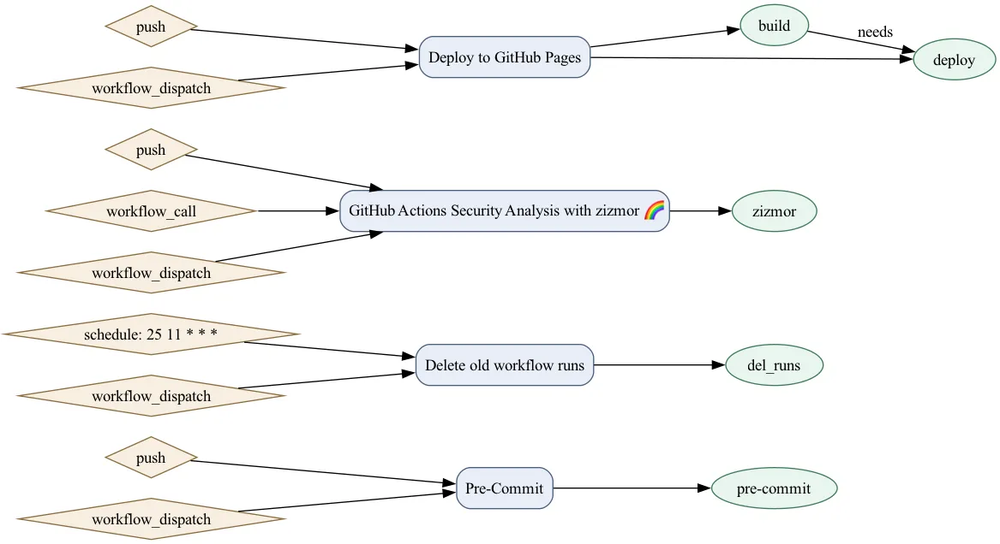

# GHA Tree Builder



Map GitHub Actions workflows into a dependency graph that includes trigger nodes, workflow nodes, and job nodes.
The output is [DOT syntax](https://graphviz.org/doc/info/lang.html) so you can render with Graphviz or any compatible tool.
If you have Graphviz installed and in your PATH, the tool can also render directly to PNG, SVG, WEBP, or other formats.

## Example Usage

```shell

```

```shell
# If no --workflow-root directory is specified, assume $PWD.
# If no --output, assume $PWD/gha-tree.dot
./tool.py

# Same defaults, but also render a PNG (requires Graphviz in PATH)
./tool.py --render=gha-tree.png

# Render WEBP and skip writing the DOT file
./tool.py --render=gha-tree.webp --no-dot

# Respect explicit CLI options
./tool.py --workflow-root=/mnt/some/example/.github/workflows \
  --output=/mnt/other/location/example.dot

# Allow env-vars to set CLI args as well
GHA_TREE_BUILDER_WORKFLOW_ROOT=/mnt/some/example/.github/workflows \
  ./tool.py --output=/mnt/other/location/example.dot

# Limit parsing to matching workflow files
./tool.py some-prefix*.yaml

# Include or exclude specific workflow files (mutually exclusive)
./tool.py --workflow-root=.github/workflows --include-glob='some-prefix*.yaml'
./tool.py --workflow-root=.github/workflows --exclude-glob='*-legacy.yml'
```

## Example Output

Using this repo's [current (as of `a693950`) GHA workflows as an example](https://github.com/kquinsland/tools/tree/a69395081acb0c5cf01d8b5dc6b2b80231722fc6/.github/workflows), this command:

```shell
❯ uv run ./content/tools/python/gha-tree-builder/tool.py --render=./content/tools/python/gha-tree-builder/images/example01.png --workflow-root=.github/workflows
# <...>
2026-01-21 17:53:42 [info     ] render_written                 output=content/tools/python/gha-tree-builder/images/example01.png
```

Produces the following output:



## Dependencies



## Changelog


